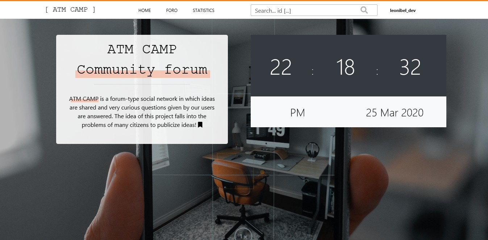

# CodeCamp-foro

## description

Code Camp ATM is a forum-type social network in which ideas are shared and very curious questions given by our users are answered.
The idea of this project falls into the problems of many citizens to publicize ideas. 
On this platform you can vote for posts you like the most and filter them by categories and tags available.

### author
> Leonibel SR [github](https://github.com/LeonibelDev "see my projects in github") or [facebook](https://facebook.com/ "contact me in facebook")

## main file
> server.js 

##  tree / structure
* server.js
* src
  * API
  * config
  * db_structure
  * PUBLIC
    * FONTS
    * favicon
  * STATIC
    * CSS
    * JS
  * VIEWS
    * TEMPLATES

## for execute
* Install the node modules run -> **npm install**
* Modify the file db_connect in [./src/config/db_connect.js]
* Add you db port of postgres
* Add you db password of postgres 

create the schemes of postgres in your system. the file is [./db_structure/project_Structure_db.sql]

## node 
**npm run start**
or
**node server.js**

## screenshot
